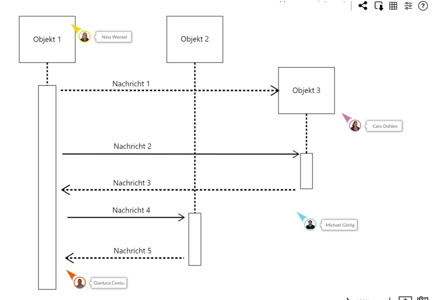

1. Wann benutze ich abstract?
Du benutzt abstract, wenn du eine Klasse erstellen möchtest, die nicht direkt instanziiert werden soll, aber dennoch gemeinsame Funktionalität oder Schnittstellen für ihre Unterklassen bereitstellt.

Ein Beispiel:

Wenn SimpsonPerson eine Klasse ist, die gemeinsame Eigenschaften oder Methoden für alle Personen in der Simpsons-Familie bietet, aber du keine direkte Instanz von SimpsonPerson erstellen möchtest, sondern nur von konkreten Unterklassen wie HomerSimpson, MargeSimpson usw.
Wenn SimpsonPerson als abstrakte Klasse eine Vorlage für HomerSimpson oder MargeSimpson darstellt, dann macht es Sinn, SimpsonPerson abstrakt zu machen.

2. was ist enum?
Mit enums (kurz für enumeration, zu deutsch: Aufzählung) bietet Java Ihnen als Programmierer die Möglichkeit, vordefinierte Konstanten für Ihre Variablen festzulegen. Dies ist besonders dann sinnvoll, wenn eine Variable nur eine kleine Anzahl von benennbaren Zuständen hat. Dabei kann es sich zum Beispiel um Spielkarten (Kreuz, Pik, Herz, Karo) handeln oder auch um den Namen des Wochentags.

3. Sequenzdiagramm
Sequenzdiagramm erstellen - So visualisierst Du Prozesse
In diesem Artikel möchten wir Dir gerne zeigen, was ein Sequenzdiagramm ist und wie es funktioniert. Außerdem haben wir einige Anwendungsbeispiele für Dich vorbereitet und erklären Dir auch die wichtigsten Symbole eines Sequenzdiagramms.

Was ist ein Sequenzdiagramm?
Sequenzdiagramme sind mächtige Werkzeuge in der Welt der Softwareentwicklung. Sie ermöglichen es, den Ablauf von Interaktionen und Prozessen in einem System auf eine verständliche Weise zu visualisieren.

Sequenzdiagramm: Definition und Erklärung
Ein Sequenzdiagramm ist eine Art von UML-Diagramm (Unified Modeling Language), das die Interaktionen zwischen verschiedenen Objekten in einem System darstellt. Es zeigt den zeitlichen Ablauf dieser Interaktionen und hilft Entwicklern, den Prozess besser zu verstehen und zu planen.

